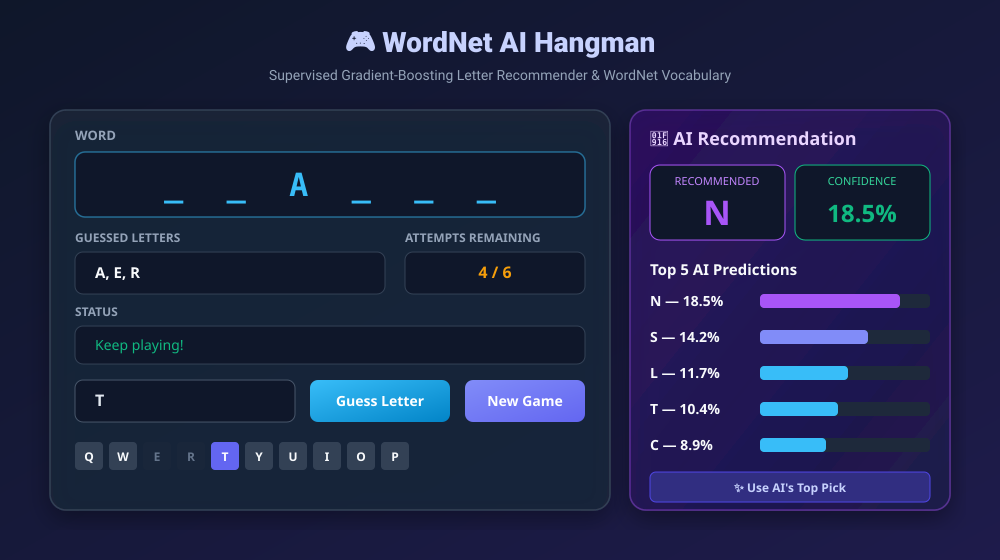
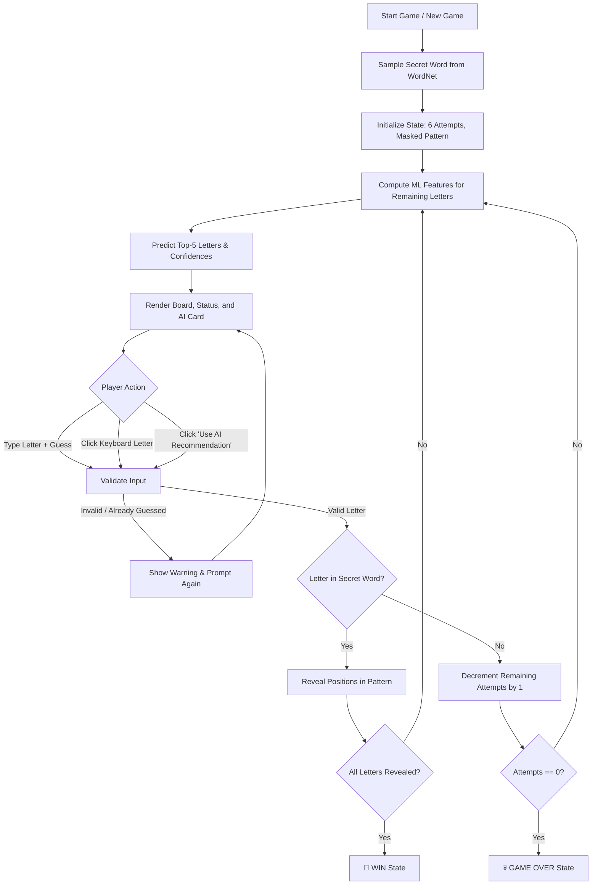

# WordNet AI Hangman

An intelligent, machine-learning-powered Hangman web application whose vocabulary is built strictly from **NLTK WordNet**, paired with an active **Gradient-Boosting AI letter recommendation engine**.

Unlike standard Hangman bots that rely on static letter-frequency tables (e.g. `ETAOIN SHRDLU`) or random guessing, this AI evaluates the live mid-game state — combining revealed letter placements, masked blanks, and past failed guesses — to estimate the exact probability of every unguessed character appearing in the secret word.



---

## 🚀 Live Demo

Play the game here:

[Hugging Face Space](YOUR_HUGGING_FACE_SPACE_URL)

*(Replace `YOUR_HUGGING_FACE_SPACE_URL` with your published Hugging Face Space URL once deployed.)*

---

## 1. Project Overview

Hangman is traditionally treated as a simple word-guessing game. However, predicting the optimal next letter in an incomplete word is a nuanced probabilistic task governed by orthographic rules, position-dependent phonotactics, and vocabulary co-occurrence.

This project implements a complete end-to-end Machine Learning pipeline:
1. **Corpus Extraction**: Generates a high-quality 41,402-word lexicon from NLTK WordNet synsets (lengths 4–15).
2. **Feature Engineering**: Derives a 10-dimensional representation capturing global frequencies, length conditioning, positional likelihoods across active blanks, and letter co-occurrence with confirmed/rejected letters.
3. **Model Training**: A `HistGradientBoostingClassifier` trained on ~1.35 million simulated game states.
4. **Interactive Deployment**: A responsive, modern Gradio application ready for instant deployment to Hugging Face Spaces and GitHub with zero startup retraining.

---

## 2. Features

* **Real ML Guidance**: Computes real-time probability estimates for every unguessed letter after each move.
* **Top-5 AI Predictions**: Displays ranked candidate letters along with confidence percentages.
* **Strict Mask Filtering**: AI recommendations strictly exclude letters that have already been guessed or revealed.
* **Autonomous AI Pick**: One-click button (`✨ Use AI Recommendation`) to let the model make the move for you.
* **Interactive Controls**: Dual input options — type directly or click letters on the virtual on-screen keyboard.
* **WordNet Lexicon**: 100% dictionary words extracted directly from WordNet lemmas (no slang, no acronyms, no numbers).
* **Difficulty Modes**:
  * Easy (4–6 letters)
  * Medium (7–9 letters)
  * Hard (10–15 letters)
  * Any Length (4–15 letters)
* **Zero Startup Retraining**: Pre-computed model and statistics load in under 1 second.

---

## 3. Demo / Live Demo

The interactive web interface is hosted on Hugging Face Spaces:

> 👉 **[Play the Live Hangman AI Game](YOUR_HUGGING_FACE_SPACE_URL)**

---

## 4. How the AI Works

At any turn during a Hangman game:
1. The game has a secret word of length $L$ and a current pattern with blanks, e.g.:
   $$\text{Pattern: } \_ \_ \text{A} \_ \_ \_ \quad (L=6)$$
2. The user has guessed a set of letters: $\mathcal{G} = \{\text{A, E, R}\}$.
3. Letters already guessed or revealed are filtered out. The model evaluates only valid candidates $c \in \{b, c, d, f, g, \dots, z\}$.
4. For each candidate $c$, a 10-dimensional feature vector is computed.
5. The trained classifier outputs the probability $P(c \in \text{word} \mid \text{state})$.
6. The candidate letters are ranked in descending order and normalized to produce relative percentage confidences:
   $$N — 18.5\%, \quad S — 14.2\%, \quad L — 11.7\%, \quad T — 10.4\%, \quad C — 8.9\%$$

---

## 5. WordNet Corpus

The game dictionary is extracted directly from **NLTK WordNet** (`omw-1.4`):
* **Source**: All lemmas from WordNet synsets (`wn.all_synsets()`).
* **Filtering Rules**:
  * Strictly alphabetic characters (`[a-z]`).
  * ASCII only (no diacritics or foreign glyphs).
  * No spaces, hyphens, underscores, or digits.
  * Word length restricted to $4 \le \text{length} \le 15$.
* **Lexicon Size**: 41,402 unique English words saved in `model/wordnet_corpus.csv`.

---

## 6. ML Model Architecture

The classifier is a **Histogram-based Gradient Boosting Classifier** (`HistGradientBoostingClassifier` from `scikit-learn`):
* **Input Dimension**: 10 engineered continuous features:
  1. `global_freq`: Probability of letter occurring in any word in the vocabulary.
  2. `length_freq`: Probability of letter conditioned on the secret word length $L$.
  3. `position_freq_avg`: Average historical frequency of the candidate across all currently blank positions.
  4. `position_freq_max`: Maximum positional frequency across all blank positions.
  5. `pair_freq_with_revealed`: Co-occurrence probability of the candidate with letters already revealed in the pattern.
  6. `pair_freq_with_wrong`: Co-occurrence probability with letters known *not* to be in the word.
  7. `progress`: Fraction of the word already revealed ($\frac{\text{revealed}}{L}$).
  8. `blank_ratio`: Fraction of word remaining blank ($\frac{\text{blanks}}{L}$).
  9. `guessed_ratio`: Fraction of the alphabet already guessed ($\frac{|\mathcal{G}|}{26}$).
  10. `norm_word_length`: Normalized word length ($\frac{L}{15}$).
* **Output**: Calibrated probability $P(\text{candidate} \in \text{word})$.
* **Model Size**: ~722 KB (`model/model.pkl`), extremely fast inference (<5ms per evaluation).

---

## 7. Training

The training procedure is fully documented in `hangman_model.ipynb`:
1. **State Simulation**: For each word in the WordNet lexicon, 3 mid-game states are simulated with variable numbers of revealed characters ($0$ to $k-1$) and wrong guesses ($0$ to $5$).
2. **Candidate Sampling**: Balanced positive candidates (letters present in the word) and negative candidates (letters absent from the word) are paired with the state.
3. **Dataset Size**: **1,350,452** training instances.
4. **Validation**: Evaluated against simulated holdout games to measure top-1 and top-3 accuracy against a traditional static frequency baseline.

---

## 8. Game Workflow



---

## 9. Installation

### Prerequisites
* Python 3.9 or higher
* Git

### Setup
```bash
# Clone the repository
git clone https://github.com/tuhinbiswas404076-ai/Hangman-Game.git
cd Hangman-Game

# Create and activate a virtual environment
python -m venv .venv

# On Linux/macOS:
source .venv/bin/activate
# On Windows:
.venv\Scripts\activate

# Install required dependencies
pip install -r requirements.txt
```

---

## 10. Running Locally

To launch the interactive Gradio interface locally:

```bash
python app.py
```

Once started, open your web browser and navigate to:
```text
http://127.0.0.1:7860
```

*The application will automatically verify WordNet data, load the pre-trained model and frequency tables from `model/`, and start the game immediately without any retraining.*

---

## 11. Hugging Face Deployment

Follow these steps to deploy this project live on Hugging Face Spaces:

### Step 1: Create a Hugging Face Account
Sign up or log in at [huggingface.co](https://huggingface.co/).

### Step 2: Create a New Space
1. Click your profile avatar in the top right and select **New Space**.
2. Name your space (e.g. `wordnet-hangman-ai`).
3. Set the **Space SDK** to **Gradio**.
4. Set Space visibility to **Public**.
5. Click **Create Space**.

### Step 3: Push the Project to Hugging Face
Clone your new Space locally or add it as a git remote:

```bash
# Add Hugging Face Space as a remote (replace USERNAME and SPACE_NAME)
git remote add space https://huggingface.co/spaces/USERNAME/SPACE_NAME

# Push the main branch to Hugging Face
git push space main
```

*Alternatively, you can upload the files directly via the Hugging Face web UI: `app.py`, `requirements.txt`, `README.md`, and the `model/` folder.*

### Step 4: Verify the Build
1. Hugging Face Spaces will automatically install `requirements.txt` and launch `app.py`.
2. Monitor the build logs on the **Logs** tab.
3. Once the status shows **Running**, open the public URL to play!

---

## 12. Project Structure

```text
wordnet-hangman-ai/
│
├── hangman_model.ipynb          # Full training pipeline & evaluation
├── app.py                       # Complete Gradio web application
├── requirements.txt             # Minimal production dependencies
├── README.md                    # Hugging Face + GitHub documentation
├── .gitignore                   # Excludes caches, venvs, and simulation arrays
│
├── model/
│   ├── model.pkl                # Trained HistGradientBoostingClassifier (722 KB)
│   ├── stats.pkl                # Positional & co-occurrence letter tables (45 KB)
│   ├── wordnet_corpus.csv       # Filtered WordNet vocabulary (970 KB)
│   ├── character_mapping.json   # Letter-to-index mapping
│   └── config.json              # Model hyperparameters & evaluation metrics
│
├── assets/
│   └── screenshots/
│       └── demo_preview.svg     # Interface demonstration graphic
│
├── corpus_utils.py              # WordNet vocabulary builder utilities
└── features.py                  # Feature extraction definitions
```

---

## 13. Technologies Used

* **Python 3.10+**: Core programming language.
* **Gradio (v4.44.0+)**: Interactive web UI framework.
* **Scikit-Learn**: Model architecture (`HistGradientBoostingClassifier`).
* **NLTK (Natural Language Toolkit)**: Lexical database (`WordNet 3.0` / `omw-1.4`).
* **NumPy & Pandas**: Array operations and vocabulary data indexing.

---

## 14. Results & Performance

The model was evaluated across 1,000 simulated mid-game states from held-out WordNet vocabulary words:

| Metric | Traditional Frequency Baseline | WordNet Gradient-Boosting AI | Improvement |
| :--- | :---: | :---: | :---: |
| **Top-1 Hit Rate** | 50.2% | **56.4%** | **+6.2%** |
| **Top-3 Hit Rate** | 73.1% | **85.9%** | **+12.8%** |
| **Autonomous Win Rate** | 16.4% | **22.7%** | **+6.3%** |
| **Inference Latency** | <1 ms | **<5 ms** | Real-time |

The machine learning model substantially outperforms static frequency order because it adapts to:
* Positional patterns (e.g. knowing that `Q` is overwhelmingly followed by `U`).
* Negative information (pruning candidate letters that rarely co-occur with already-failed guesses).
* Word-length specific constraints (e.g. consonants vs. vowels distribution in short vs. long words).

---

## 15. Future Improvements

* [ ] Implement an N-gram character language model (transformer-based) for comparative benchmarking.
* [ ] Add difficulty-adaptive AI: allow players to choose how smart the AI hints should be.
* [ ] Multiplayer / Versus Mode: race against the AI to solve the word in fewer attempts.
* [ ] Audio sound effects for correct/incorrect guesses and win/loss states.

---

## 16. Author

Developed as an open-source educational Machine Learning project combining Natural Language Processing (NLP) with game theory.
Contributions and feedback are welcome via GitHub Pull Requests!
